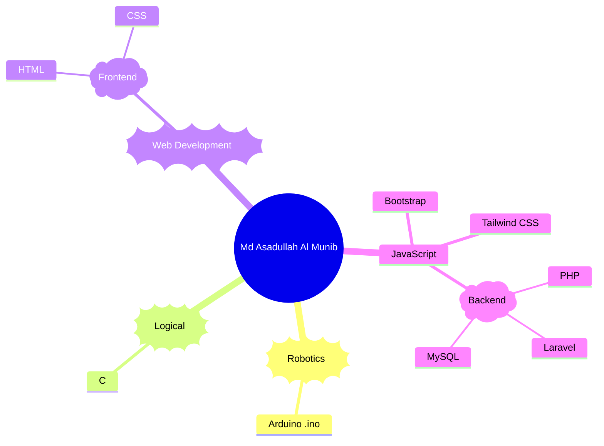

<!-- HEADER: Capsule Render - Wavy visual with TokyoNight theme -->

  

<!-- DYNAMIC TAGLINE: Typing animation to grab attention -->

  

  
  
  
  
  
  
  
  

---

### 👨‍💻 Discovering My Journey
I am a dedicated student from **Rangpur, Bangladesh**, currently in my first year of **Alim (HSC)** at Dhap Satgara B. M. Model Kamil Madrasah. My passion lies at the intersection of **software and hardware**, where I build web applications and Arduino-powered robotics projects.

- 🎓 **Academic:** Passed Dakhil (SSC) in 2025; currently exploring the depths of computer science.
- 🌐 **Web Expertise:** Proficient in creating responsive experiences using **PHP, Laravel, and JavaScript**.
- 🤖 **Hardware Projects:** Designing innovative solutions like **Ultrasonic Radar systems** using Arduino and C++.
- ✍️ **Writing:** I write articles exploring **science, technology, and Islamic perspectives** to share knowledge.

---

### 🏆 Top Honors & Recognition
- 🥇 **2nd Position**: Regional Programming Contest (2024) organized by **BCC Rangpur**.
- 🎖️ **8th Position**: National Innovation Fair (2024) organized by the **Bangladesh Madrasah Education Board**.

---

 
<h1>🔥Programming Languages🔥</h1>

  
  
  
  
  
  
  
  
  

---

### 📊 Performance Dashboard
<!-- GRID LAYOUT: Professional and clean data visualization -->
<table align="center">
  <tr>
    <td></td>
    <td></td>
  </tr>
  <tr>
    <td colspan="2" align="center"></td>
  </tr>
</table>

<!-- TROPHIES: Dynamic achievement tracker using mirror link for uptime -->
<!--  

  

 -->

---

### 📂 Spotlight Projects
- 🛠️ **[TTAS Animation](https://asadullahalmunib.github.io/TTAS/)**: A custom JS library for seamless text-typing effects.
- 🧮 **[Multifunctional Calculator](https://github.com/AsadullahAlMunib/Multifunctional_Calculator)**: A powerful C-language tool with 7 advanced math functions.
- 📡 **[Ultrasonic Radar](https://github.com/AsadullahAlMunib/Ultrasonic_Radar)**: A hardware-software hybrid built using Arduino.
- 📁 **[Responsive Portfolio](https://asadullahalmunib.github.io/Portfolio/)**: My full-scale digital showcase.

---

### 🌐 Let's Connect
- 🌍 **Portfolio:** [munib.rf.gd](http://munib.rf.gd)
- 📍 **Location:** Mithapukur, Rangpur, Bangladesh
- 💬 **Open to:** Collaboration on Robotics and Open Source projects.

---

<!-- FOOTER: Isometric 3D Visualization of contribution history -->

  <i>"Learning never stops. My goal is to create meaningful projects and inspire others through innovation."</i>

